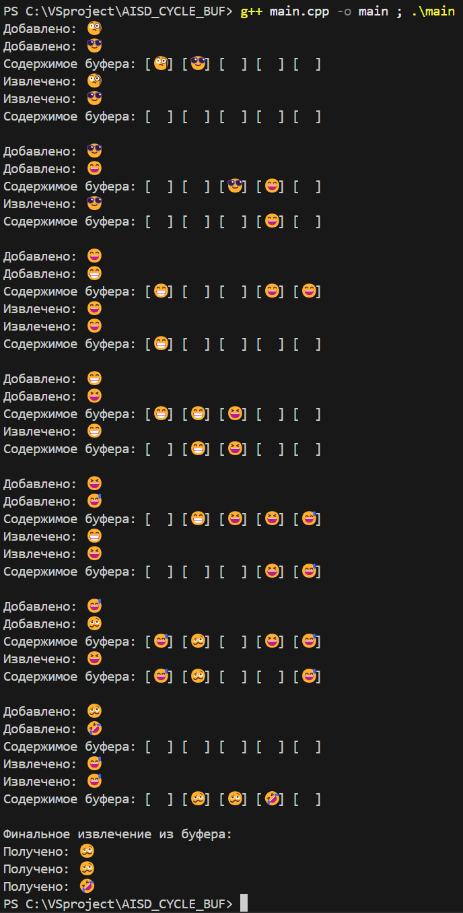

# AISD_CYCLE_BUF
### Хотел отправить тот буфер, который делал для uart, но там как-то совсем печально всё, решил сделать так. Просто консольная программка. Вроде бы наглядно получилось. 
### Вывод в консоль:

